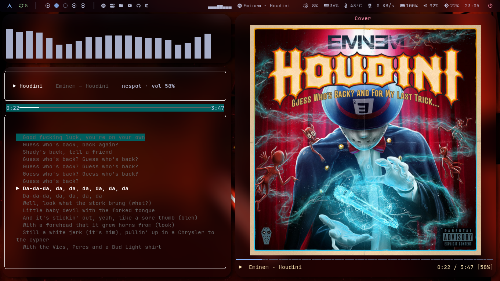
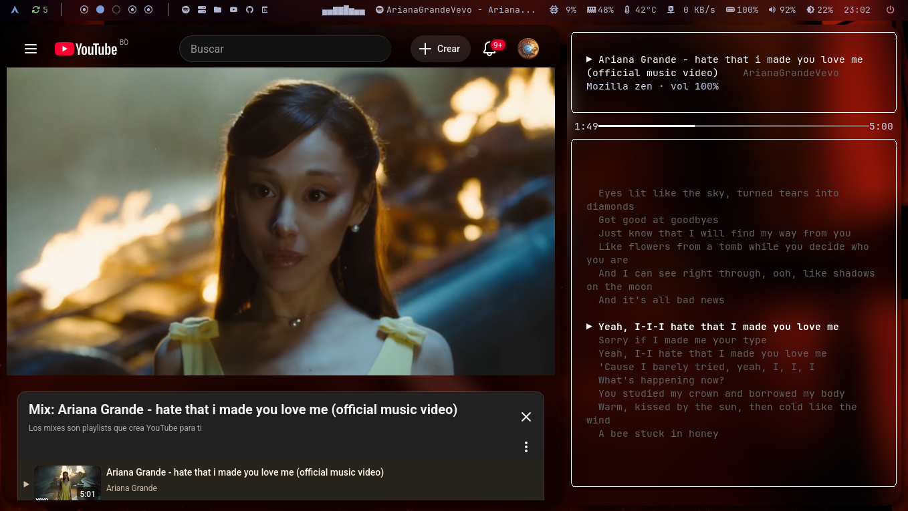

# player-tui 🎵

Terminal music player with **real-time synchronized lyrics** — a Spotify-style TUI for Linux/macOS.

Works with **any MPRIS2-compliant player** (Spotify, Firefox, Chromium, VLC, mpv, ncspot, …) and fetches
timed lyrics from [LRCLIB](https://lrclib.net/).

## Screenshots

| Spotify | YouTube |
|---------|---------|
|  |  |

---

## ✨ Features

- 🎵 **Real-time synced lyrics** from the LRCLIB database, with a progress bar and active-line highlighting
- 🎮 **MPRIS2 support** — auto-detects the currently playing media from Spotify, Firefox, ncspot, VLC, mpv, or any MPRIS2-compliant player
- 🎨 **Customizable themes** — 16 accent colors + 17 border colors (including white)
- 🖥️ **True transparency** — uses `ansi_default` so the app blends with your terminal's transparent background
- ⌨️ **Vim-like keybindings** — play/pause, next/prev, volume and mute from the keyboard
- 💾 **Persistent preferences** — accent/border colors saved to `~/.config/reproductorMusica/config.json`
- 🔌 **WebSocket lyrics server** — stream player state and lyrics to panels, browsers or other clients (port `23560`)
- 📱 **Responsive layout** — adapts to any terminal size

---

## 🚀 Installation

### Option 1: From the release wheel (no source checkout required)

```bash
# NOTE: replace the version in the filename with the latest release
pip install https://github.com/jorgeTTPD/player-tui/releases/latest/download/player_tui-1.2.0-py3-none-any.whl
player-tui
```

### Option 2: pipx (Recommended for Python users)

```bash
pipx install git+https://github.com/jorgeTTPD/player-tui.git
player-tui
```

### Option 3: From Source

```bash
git clone https://github.com/jorgeTTPD/player-tui.git
cd player-tui
pip install -e .
player-tui
```

### Option 4: Arch Linux (PKGBUILD)

```bash
git clone https://github.com/jorgeTTPD/player-tui.git
cd player-tui
python -m build --sdist          # generates dist/player-tui-<version>.tar.gz
cp dist/player-tui-*.tar.gz .    # place the tarball next to the PKGBUILD
makepkg -si                      # build and install with pacman
```

---

## ⌨️ Keybindings

| Key | Action |
|-----|--------|
| `space` | Play / Pause |
| `j` | Previous track |
| `l` | Next track |
| `i` | Volume up |
| `k` | Volume down |
| `m` | Mute toggle |
| `u` | Cycle accent color (Text) — 16 colors |
| `o` | Cycle border color (Edge) — 17 colors |
| `q` | Quit |

> **Footer keys** are always white. Press `Ctrl+P` for the command palette.

---

## ⚙️ Configuration

Colors are persisted to `~/.config/reproductorMusica/config.json`:

```json
{
  "accent_index": 3,
  "border_index": 5
}
```

- Press `u` to cycle through 16 accent colors
- Press `o` to cycle through 17 border colors (includes white)

### Environment variables

| Variable | Default | Description |
|----------|---------|-------------|
| `LRC_CACHE_DIR` | `~/.cache/lyrics-on-panel` | Directory where fetched lyrics are cached |

---

## 🔌 WebSocket Server

The built-in lyrics server exposes player state and lyrics over WebSocket on `127.0.0.1:23560`:

| Endpoint | Description |
|----------|-------------|
| `ws://127.0.0.1:23560/healthcheck` | `{"status": "ok"}` |
| `ws://127.0.0.1:23560/poll` | Current player state (track, position, lyrics) |
| `ws://127.0.0.1:23560/control` | Send playback actions (`play`, `pause`, `next`, …) |

This powers lyrics displays in panels, browsers, or any custom client.

---

## 🖥️ Requirements

- **Linux/macOS** with an **MPRIS2-compatible media player** (Spotify, Firefox, ncspot, VLC, mpv, …)
- **Python 3.10+** (for source install)
- **D-Bus session bus** (standard on Linux desktop)
- **Terminal with true color support** (most modern terminals)

---

## 🔨 Building from Source

```bash
git clone https://github.com/jorgeTTPD/player-tui.git
cd player-tui
pip install -e .
player-tui
```

### Build Standalone Binary

```bash
pip install pyinstaller
pyinstaller --onefile --name player-tui player_tui/__main__.py
# Binary at dist/player-tui
```

---

## 📦 Packaging

| Format | Status |
|--------|--------|
| **Arch Linux (PKGBUILD)** | ✅ Included |
| **Fedora/RHEL (SPEC)** | ✅ Included (`player-tui.spec`) |
| **Python Wheel** | ✅ `pyproject.toml` |
| **Standalone Binary** | ✅ PyInstaller (buildable; not yet published as a release asset) |

---

## 📄 License

MIT License — see [LICENSE](LICENSE) for details.

Based on [lyrics-on-panel](https://github.com/KangweiZhu/lyrics-on-panel) by KangweiZhu (MIT).

---

## 🙏 Acknowledgments

- [lyrics-on-panel](https://github.com/KangweiZhu/lyrics-on-panel) — Original lyrics backend
- [LRCLIB](https://lrclib.net/) — Lyrics database
- [Textual](https://textual.textualize.io/) — TUI framework
- [MPRIS2](https://specifications.freedesktop.org/mpris-spec/latest/) — Media Player Remote Interfacing Specification
